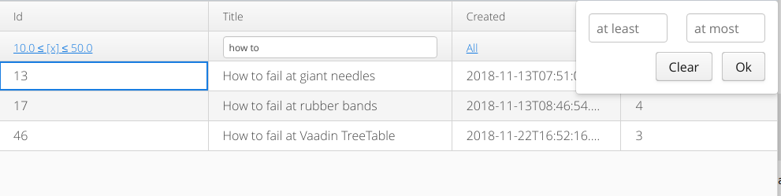

[](http://vaadinonkotlin.eu)
[](https://travis-ci.org/mvysny/vaadin8-restdataprovider-example)

# Vaadin 8 REST Data Provider Example App

Demonstrates the use of a full-blown REST DataProvider in a Vaadin 8 Grid. Please read more on
how this exactly works at [Accessing NoSQL or REST data sources](http://www.vaadinonkotlin.eu/nosql_rest_datasources.html).
To demo the REST capabilities totally standalone, this project:

* Configures Grid to fetch the data over REST from `localhost:8080/rest/articles`
* Exposes the REST CRUD endpoints on `localhost:8080/rest/articles` and uses vok-orm to fetch
data from an in-memory H2 database.

Only requires a Servlet 3.0 container to run. Developed in Kotlin. Also demoes an auto-generated
Grid filter bar, therefore this example serves as a full replacement for Teppo Kurki's
[FilteringTable](https://vaadin.com/directory/component/filteringtable).

The screenshot of this app:


The project uses code from [Vaadin-on-Kotlin](http://vaadinonkotlin.eu).

> Please see [vaadin10-restdataprovider-example](https://gitlab.com/mvysny/vaadin10-restdataprovider-example)
for a Vaadin 14-based REST server example app.

# Getting Started

To quickly start the app, make sure that you have Java 8 JDK installed. Then, just type this into your terminal:

```bash
git clone https://github.com/mvysny/vaadin8-restdataprovider-example
cd vaadin8-restdataprovider-example
./gradlew build web:appRun
```

The app will be running on [http://localhost:8080/](http://localhost:8080/). You can access the CRUD endpoint via
the command line:

```bash
curl "localhost:8080/rest/articles?sort_by=created,-title&score=4&title=ilike:the&offset=5"
```

or via the browser: [localhost:8080/rest/articles?sort_by=created,-title&score=4&title=ilike:the&offset=5](http://localhost:8080/rest/articles?sort_by=created,-title&score=4&title=ilike:the&offset=5)

When playing with the endpoint, do note that there are 1000 rows generated randomly but
the CRUD endpoint is limited to return at most 100 (this is of course configurable).

> Note: The CRUD endpoint support full filtering, sorting and paging capabilities.
For details please see the [vok-rest](https://github.com/mvysny/vaadin-on-kotlin/tree/master/vok-rest)
VoK module documentation.

Since the build system is a Gradle file written in Kotlin, we suggest you use [Intellij IDEA](https://www.jetbrains.com/idea/download)
to edit the project files. The Community edition is enough to run the server
via Gretty's `./gradlew web:appRun`. The Ultimate edition will allow you to run the project in Tomcat - this is the recommended
option for a real development.

# Workflow

To compile the entire project, run `./gradlew`.

To run the application, run `./gradlew web:appRun` and open [http://localhost:8080/](http://localhost:8080/) .
